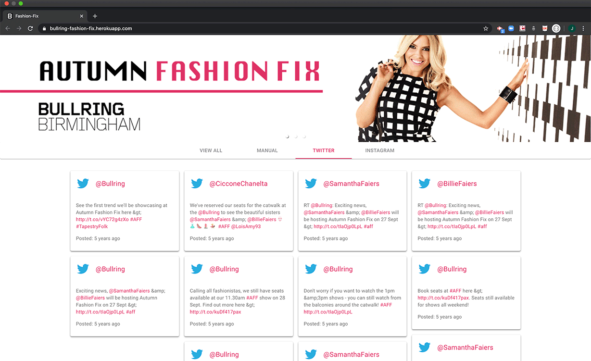

 

---

## Table of Contents
  * [Summary](#Summary)
  * [Technologies](#technologies)
  * [Features And Functionality](#features-and-functionality)
  * [File Architecture](#file-architecture)
  * [Click here to visit the site!](https://bullring-fashion-fix.herokuapp.com/)
---

## Summary 
 > This is a promotional application for Bullring Birmingham's Annual Autumn Fashion Fix Event. Usuers are able to view the "social wall" to discover latests trends and releven social media posts from Twitter and Instagram. 
---

## Technologies
> <b>Design Tools:</b>
  * Adobe Illustrator
  * Adobe Photoshop
  
> <b>Development Tools:</b>
  * <b>Framework:</b> Material UI
  * React
  * Express
  * Path 
  * Node 
  * if-env
  * Moment
  * Concurrently
  * Git
  * Heroku (Heroku build)
---

## Features And Functionality

  * <b>Responsive design to accommodate any screen width (mobile, tablet, desktop, etc.) These images were generated by using a mobile emulator.</b>
    
 
  * <b>Filter post types to display specific information (View All, Manual, Twitter, Instagram)</b>
     
        
  * <b>Open links in a new window</b>
     

  * <b>Load more posts</b>
     
        
  * <b>Loading Site: React, { Lazy, Suspense } - displays a CSS loading annimation to provide user feedback while the site loads. This feature was tested by reducing the network speed in the Chrome Browser extension.</b>
     
---

## File Architecture

<b>Click To View</b>

 

         Fashion Fix
         ├── Client
         │   ├── build
         │   ├── node_modules
         │   ├── public
         │   ├── src
         │   │   ├── Assets
         |   │   │   ├── globalCss
         |   |   │   │   ├── layout.css
         |   |   │   │   ├── mediaScreens.css  
         |   |   │   │   ├── reset.css  
         |   |   │   │   └── typography.css 
         |   │   │   └── images
         |   |   │   │   ├── image_1.gif  
         |   |   │   │   ├── image_2.gif  
         |   |   │   │   └── image_3.gif
         │   │   ├── Components
         |   │   │   ├── Cards
         |   |   │   │   ├── instagram.js          
         |   |   │   │   ├── manual.js
         |   |   │   │   └── twitter.js
         |   │   │   ├── Carousel
         |   |   │   │   ├── index.js
         |   |   │   │   └── style.css
         |   │   │   ├── Footer
         |   |   │   │   └── index.js
         |   │   │   └── Loading
         |   |   │       └── index.js
         │   │   ├── Pages
         |   │   │   └── socialWall.js
         │   │   ├── utils
         |   │   │   └── API.js
         │   │   ├── App.js
         │   │   ├── App.test.js
         │   │   ├── index.js
         │   │   ├── serviceWorker.js 
         │   │   └── setupTests.js
         │   ├── .gitignore
         │   └── package.json
         ├── node_modules
         ├── routes
         ├── .gitignore
         ├── package.json
         ├── Readme.md 
         └── server.js

---

[Back To Top](#welcome-to-Fashion-Fix)
